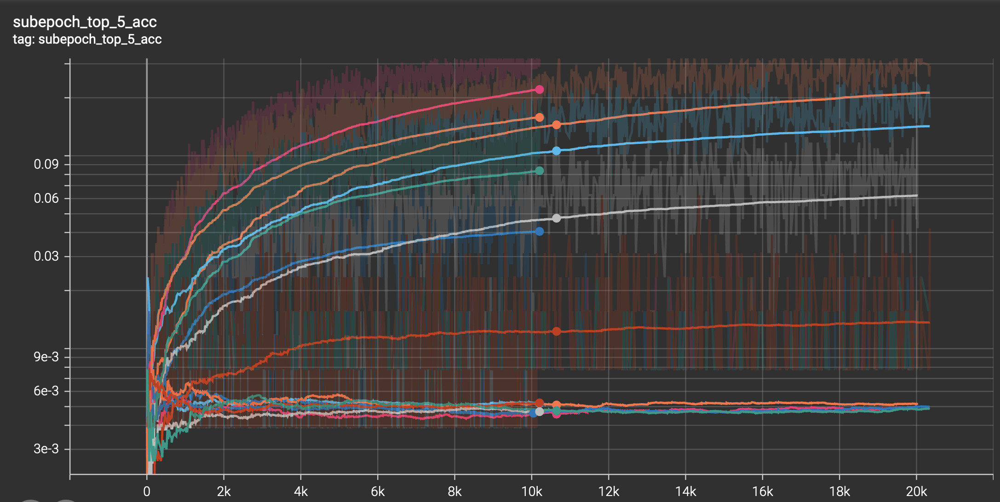

# Cerebro: Scalable Deep Learning on Clusters


<code>Cerebro</code> is an end-to-end ML Systems platform that provides efficient scaling of
Deep Learning model selection, regardless of the size of the datasets or models.
With Cerebro, model building can be effortlessly scaled across multiple GPUs and across multiple nodes of the cluster.
Users provide their ML code via a Jupyter Notebook interface, while Cerebro handles all distributed machine learning operations in the background.

This project is currently offered on SDSC's [Voyager](https://www.sdsc.edu/support/user_guides/voyager.html#accounts) cluster. The list of supported PyTorch function calls on Voyager's Habana processor can be found [here](https://docs.habana.ai/en/latest/PyTorch/PyTorch_Model_Porting/GPU_Migration_Toolkit/Habana_GPU_Migration_APIs.html).
We support only PyTorch as of now.


## Features

- [x] Distributed Data Pre-processing
- [x] Distributed Train and Validation and Test
- [x] Distributed Model Inference
- [x] Metrics Vizualization via Tensorboard
- [x] Jupyter Notebook Interface
- [x] Easy-to-implement model building template
- [x] No complex cluster setup process


## Usage
You can interact with Cerebro by filling out code templates, which are then picked up and internally scaled across the cluster resources. A copy of the template can be found [here](setup/misc/experiment.ipynb).
We recommend storing your datasets for your experiments in Voyager's [Ceph storage](https://www.sdsc.edu/support/user_guides/voyager.html#storage).
The user is expected to provide the following details about their experiment:
 
1. <b>Dataset Locators</b> - Datasets are expected to be in tabular .csv format where each example is a row and the features are columns. The path to these dataset files will be specified in the <i>params</i> field on the Jupyter Notebook. <br />
   
   If your data contains multi-modal object files (images, text, video, etc.), you can specify the relative path to your object file in the .csv as shown below. This example is the train dataset file for the Microsoft COCO image captioning dataset - 

   | Image Object           | Height | Width | Captions                                    |
   |------------------------|--------|-------|---------------------------------------------|
   | train/000000318219.jpg | 640    | 556   | "A girl watching computer screen"           |
   | train/000000184613.jpg | 336    | 500   | "A boy with an umbrella"                    |
   | train/000000391895.jpg | 360    | 640   | "A man riding on the back of a motorcycle"  |

   <b>A more detailed explanation of the list of accepted Dataset Locators can be found [here](docs/dataset_locators.md). </b>


2. <b>ETL Specification</b>: If you dataset needs to be pre-processed before feeding it into the model, you can add your code in the ETL Spec Class. Cerebro will process the entire dataset in parallel, across all workers. Arguments to functions in this class can be used as inputs for completing your code. Cerebro will supply values to these arguments each time it is called, by reading the dataset. <br />
   <b> More details about the class can be found [here](docs/etl_spec.md)</b>.

 
3. <b>Minibatch Specification</b>: For model building operations such as train, validation, test and inference, you can add your code in the Minibatch Spec Class. Cerebro will partition your dataset across all workers and train your models using all GPUs in a worker. Similarly, validation, test and prediction are also done in parallel across all workers. Arguments to functions in this class can be used as inputs for completing your code. Cerebro will supply values to these arguments each time it is called, based on the models and the datasets. <br />
   <b> More details about the class can be found [here](docs/mop_spec.md)</b>.


4. <b></b>
Cerebro allows you to view metrics from all your models in real-time on the same graph in Tensorboard
Templates - minibatch level
num_epochs, param_grid
run everything
view on Tensorboard

## Setup and Installation
1. Login to the Voyager console by obtaining access as mentioned [here](https://www.sdsc.edu/support/user_guides/voyager.html#access), and clone this repository.
    ```
    ssh <username>@login.voyager.sdsc.edu
    ```
    If you're using Cerebro for the first time, you would need to install Cerebro dependency packages. From the cerebro-voyager directory, run 
    ```
    bash setup/install.sh
    ```
2. Now, you can start Cerebro using the following command. Note that it might take a while to spawn your resources for the first time. From the cerebro-voyager directory, run
    ```
    python3 cerebro.py start
    ```
3. Once ready, you will need to run the SSH tunnel command that's given in the output on your <b> local machine's terminal </b>. This command needs to be running for you to maintain communication with the cluster. 


4. You can now open the Jupyter Notebook using the link in the output. This can be done via the [JupyterLab Desktop](https://github.com/jupyterlab/jupyterlab-desktop) app (recommended) or via the browser.
If you're using JupyterLab Desktop, you can copy-paste the link in the <i>Connect</i> window.


5. Once you have completed your experiments, you can clear up cluster resources by running
   ```
   python3 cerebro.py shutdown
   ```
<b>A detailed list of all commands and their usage can be found [here](docs/setup_options.md).</b>   

## Examples
A sample implementation of model selection for Resnet50 on the Imagenet dataset using Cerebro can be found [here](examples/Resnet%20on%20Imagenet). The top-5 accuracy of some of the models trained are shown below - 


## Support
For issues and feature requests, please open a [GitHub issue](https://github.com/prsridha/cerebro-voyager/issues).


