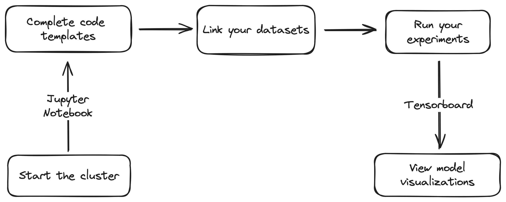
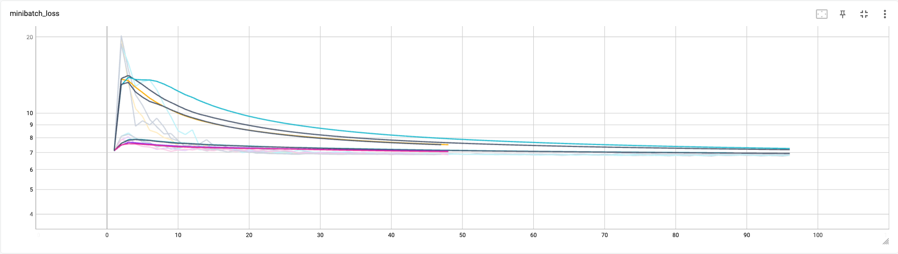
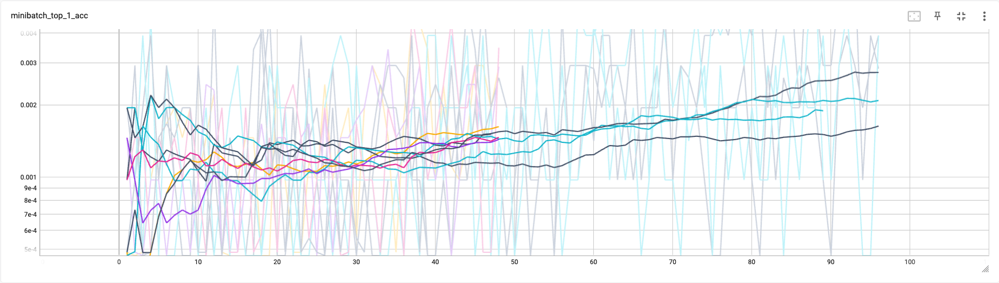

# Cerebro: Scalable Deep Learning on Clusters


<code>Cerebro</code> is an end-to-end ML Systems platform that provides efficient scaling of
Deep Learning model selection, regardless of the size of the datasets or models.
With Cerebro, model building can be effortlessly scaled across multiple GPUs and across multiple nodes of the cluster.
Users provide their ML code via a Jupyter Notebook interface, while Cerebro handles all distributed machine learning operations in the background.

This project is currently offered on SDSC's [Voyager](https://www.sdsc.edu/support/user_guides/voyager.html#accounts) cluster. The list of supported PyTorch function calls on Voyager's Habana processor can be found [here](https://docs.habana.ai/en/latest/PyTorch/PyTorch_Model_Porting/GPU_Migration_Toolkit/Habana_GPU_Migration_APIs.html).
We support only PyTorch as of now.


## Features

- [x] Distributed Data Pre-processing
- [x] Distributed Train and Validation and Test
- [x] Distributed Model Inference
- [x] Metrics Vizualization via Tensorboard
- [x] Jupyter Notebook Interface
- [x] Easy-to-implement model building template
- [x] No complex cluster setup process


## Usage


1. <b>Start the cluster</b> - You begin by starting the cluster, following the steps given in the [next section](#setup-and-installation).
<br/> <br/>

2. <b>Complete code templates</b> - In the Jupyter Notebook, you can interact with Cerebro by filling out code templates, which are then picked up and internally scaled across the cluster resources. A copy of the template can be found [here](setup/misc/experiment.ipynb). This template will be available as an .ipynb file in the Notebook. Additionally, you can upload any relevant files, including a requirements.txt containing your project's dependencies.
   <br/><br/>

   If your dataset needs to be pre-processed before feeding it into the model, you can add your code in the ETL Spec Class. Cerebro will process the entire dataset in parallel, across all workers. Here, the data is shuffled, sharded across workers, the multi-modal object files are downloaded and the entire dataset is processed into Tensors for future model building. <br />
   More details about the class can be found <b>[here](docs/etl_spec.md)</b>.
   <br/> <br/>
   For model building operations such as train, validation, test and inference, you can add your code in the Minibatch Spec Class. Cerebro will partition your dataset across all workers and train your models using all GPUs in a worker. Similarly, validation, test and prediction are also done in parallel across all workers. Arguments to functions in this class can be used as inputs for completing your code. Cerebro will supply values to these arguments each time it is called, based on the models and the datasets. <br />
   More details about the class can be found <b>[here](docs/mop_spec.md)</b>.
<br/> <br/>

3. <b>Link your datasets</b> - Datasets are expected to be in tabular .csv format where each example is a row and the features are columns. The path to these dataset files, known as Dataset Locators, will be specified in the <i>params</i> field on Jupyter Notebook. We recommend storing your datasets in Voyager's [Ceph storage](https://www.sdsc.edu/support/user_guides/voyager.html#storage). Cerebro supports multi-modal object files such as images, text, video or any object file.

   A detailed explanation of the list of accepted Dataset Locators can be found <b>[here](docs/dataset_locators.md)</b>.
<br/> <br/>

4. <b>Run your experiments</b> - Along with the code templates, you must provide details about your model selection workload. This includes the number of epochs and the hyperparameter search space. This is passed to Cerebro via the Experiment class object. Using this class, you can run data preprocessing on your datasets, train your models, validate, test and run inference too. This will be done across all workers and using all GPUs on each worker. Cerebro also supports direct model inference with pretrained models.
    
   More details about the class can be found <b>[here](docs/experiment.md)</b>. 
<br/> <br/>

6. <b>View model visualizations</b> - You can visualize metrics from all your models in real-time on a single graph via Tensorboard. It can be accessed by the link provided when you create the cluster or using the Tensorboard button that appears when you create an Experiment object.
<br/> <br/>

## Setup and Installation
1. Login to the Voyager console by obtaining access as mentioned [here](https://www.sdsc.edu/support/user_guides/voyager.html#access), and clone this repository.
    ```
    ssh <username>@login.voyager.sdsc.edu
    ```
    If you're using Cerebro for the first time, you would need to install Cerebro dependency packages. From the cerebro-voyager directory, run 
    ```
    bash setup/install.sh
    ```
2. Now, you can start Cerebro using the following command. Note that it might take a while to spawn your resources for the first time. From the cerebro-voyager directory, run
    ```
    python3 cerebro.py start
    ```
3. Once ready, you will need to run the SSH tunnel command that's given in the output on your <b> local machine's terminal </b>. This command needs to be running for you to maintain communication with the cluster. 


4. You can now open the Jupyter Notebook using the link in the output. This can be done via the [JupyterLab Desktop](https://github.com/jupyterlab/jupyterlab-desktop) app (recommended) or via the browser.
If you're using JupyterLab Desktop, you can copy-paste the link in the <i>Connect</i> window.


5. Once you have completed your experiments, you can clear up cluster resources by running
   ```
   python3 cerebro.py shutdown
   ```
<b>A detailed list of all commands and their usage can be found [here](docs/setup_options.md).</b>   

## Examples
A model selection experiment for [Resnet50 on Imagenet](examples/Resnet%20on%20Imagenet) has been implemented using Cerebro, by varying hyperparameter such as batch size, learning rate and lambda values, leading to 8 unique hyperparameter combinations.

The minibatch loss during training for all the models is shown below - 


The top1 accuracy during training for all the models is shown below -


## Support
For issues and feature requests, please open a [GitHub issue](https://github.com/prsridha/cerebro-voyager/issues).

## Acknowledgements

