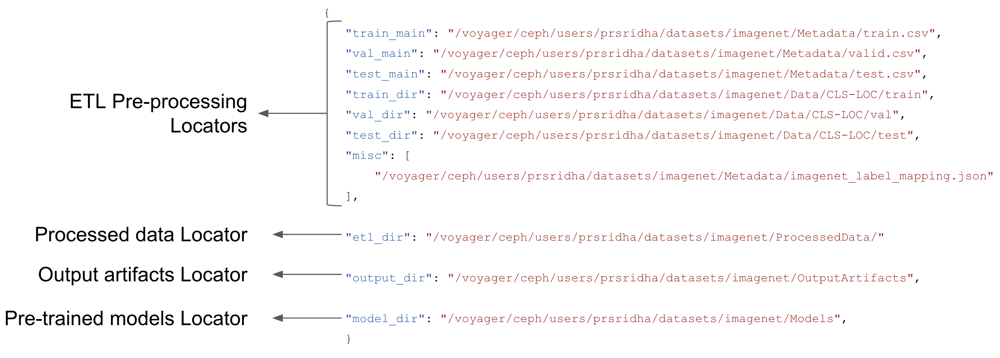
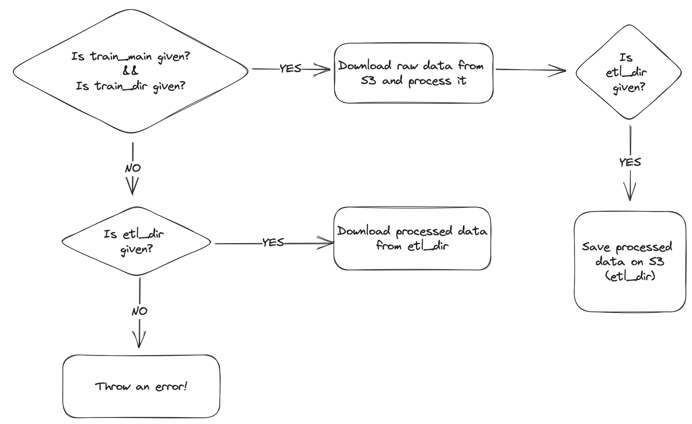

<h1>Dataset Locators</h1>

<b>Dataset Locators</b> are the URLs or paths that point to the dataset files and object files of your experiment. They are passed to Cerebro via the <i>param</i> field in the Jupyter Notebook code.

1. <b>Dataset files</b> ('*_main' in params) are required to be in tabular .csv format, with the first line as a header that starts with the id, followed by all the features of your dataset. Each row of this file will be an example in your dataset. You need to create different files for train, val, test and inference. Cerebro supports direct Model inference (with pretrained models) without the train, val and test steps.

2. <b>Object files</b> ('*_dir' in params)- 
If your data contains multi-modal object files (images, text, video, etc.), you can specify the relative path to your object file for each example row, in the respective feature column. This object path should be relative to the base directory path provided in the <i>params</i> field.

3. <b>Miscellaneous files</b> - Any auxiliary files that do not fit into the Dataset files and Object files format can be passed via te misc field. In the example below we are passing a JSON file that contains Imagenet labels that are mapped to their numeric IDs, which will be used in inference. All misc. files need to be specified in a List.

4. <b>ETL Dir</b> -  This directory is used for storing processed data for re-use in future experiments. If the the ETL pre-processing locators are specified along with ETL Dir, then the data is processed and written to ETL Dir. If only ETL Dir is specified, then the already processed data will be read in for the next model building steps.  

5. <b>Output Dir</b> - After the experiment is complete, Cerebro saves relavant experiment artifacts such as model training checkpoints, metrics and other files.

6. <b>Model Dir</b> - If you want to do plain inference without any training, you can specify the location of pre-trained models via Model Dir. 

A sample <i>params</i> dictionary is given below - 

When multiple Dataset Locators are given, Cerebro has been designed to intuitively pick the correct set of tasks. An example of this parsing for the train task is depicted below:

