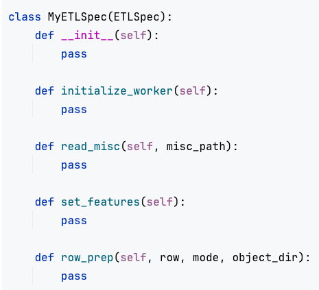

# ETL Specification

The ETL Spec class has functions which, when filled with code, instruct Cerebro on how to process your datasets before using it for model building. The arguments to the functions of this class will be provided by Cerebro. You can make use of these argument variables to implement the function with your code.
Your can refer to the implementation given [here](../examples/Resnet%20on%20Imagenet/cerebro_imagenet.ipynb) for Resnet50 on Imagenet as an example.
Also, we recommend that all the Python imports that a particular function needs be specified within the function body, and not outside it. The Minibatch Spec class can contain any other functions defined by the user, called from within the functions given below.

The ETL Spec class has the following functions.

1. <b>initialize worker()</b>: This function is used for setup of packages or for other one-time-per-worker tasks. This function will be executed exactly once on each worker. For example - if you task involves NLP, you would add code to download tokenizer models from NLTK here.   
2. <b>read_misc</b>: This function is for accessing the files specified under the <i>misc</i> field in <i>params</i>. 
 
<i>Arguments</i>:  
   - misc_path - The directory path in which all <i>misc</i> files present. The files can be accessed by appending the file names to this path.
     

   <i>Returns</i>: None
 
3. <b>set_features:</b> This function is to specify which features of the dataset point to multi-modal object files that need to be donwloaded seperately from a <i>'*_dir'</i> Dataset Locator.   

    <i>Arguments</i>: None  

   <i>Returns</i>: List containing boolean values of True if the feature points to an object file and False if it's a regular feature. There must be one value for every feature in the dataset.  

4. <b>row_prep:</b> Code to process a single row of the dataset is given here. The function will return the processed row as a PyTorch Tensor.
 
<i>Arguments</i>:  
   - row - a single row from the dataset. Each feature in the row can be indexed by the feature name as given in the .csv file
   - mode - the current mode of pre-processing. This can be one of train, val, test or predict.
   - object_dir - the outer directory path which contains the object files. The file can be accessed by concatenating the relative path in the feature's value. 
     

   <i>Returns</i>: For train, val and test modes, the function must return a tuple of two PyTorch Tensors - the processed Tensor and the label Tensor. For predict mode, the function must return a tuple of the processed tensor and None. 
 

  
The ETL Spec class template -

