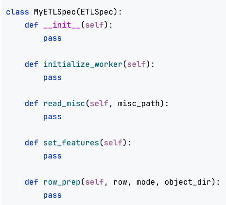

# Minibatch Specification

Similar to the ETL Spec, the Minibatch Spec class has functions which, when filled with code, instruct Cerebro on how to build, train and evaluate your models. Your can refer to the implementation given [here](../examples/Resnet%20on%20Imagenet/cerebro_imagenet.ipynb) for Resnet50 on Imagenet as an example. 
Also, we recommend that all the Python imports that a particular function needs be specified within the function body, and not outside it. The Minibatch Spec class can contain any other functions defined by the user, called from within the functions given below. 
The Minibatch Spec class has the following functions.

1. <b>initialize worker()</b>: This function is used for setup of packages or for other one-time-per-worker tasks. This function will be executed exactly once on each worker. For example - if you task involves NLP, you would add code to download tokenizer models from NLTK here.   
2. <b>read_misc</b>: This function is for accessing the files specified under the <i>misc</i> field in <i>params</i>. 
 
<i>Arguments</i>:  
   - misc_path - The directory path in which all <i>misc</i> files present. The files can be accessed by appending the file names to this path.
     

   <i>Returns</i>: None
 
3. <b>create_model_components:</b> This function is to create models for model selection using the hyperparameter combination that Cerebro generates.   

    <i>Arguments</i>:  
   - hyperparams - a single hyperparameter configuration dictionary, picked from all possible combinations of <i>param grid</i>. 
     

   <i>Returns</i>: A dictionary mapping the model object names to the model objects. Here, the model objects refer to the entire model saved as a file (not just the state_dict). The dictionary should also contain a key named “optimizer” pointing to the optimizer object.

4. <b>metrics_agg:</b> This function is to aggregate metrics that have been generated at each iteration of the train, val and test operations.
 
<i>Arguments</i>:  
   - mode - this string can be one of "train", "val", "test" or "predict", depending on the current operation.
   - hyperparams: a single hyperparameter configuration dictionary, for the model in question.
   - metrics: this is a dictionary whose keys are the same as the ones returned by the <i>train</i> function or the <i>valtest</i> function. The dictionary's values are a list of accumulated metrics from each iteration of the <i>train</i> function or the <i>valtest</i> function. 
     

   <i>Returns</i>: For train, val and test modes, the function must return a tuple of two PyTorch Tensors - the processed Tensor and the label Tensor. For predict mode, the function must return a tuple of the processed tensor and None. 
 

  
The ETL Spec class template -

